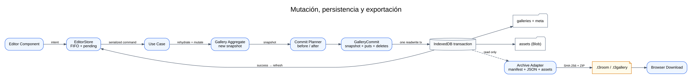
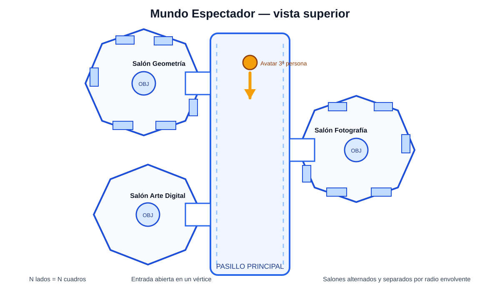

<!-- Authorized: root -->
<!-- 
    **PLANNING INSTRUCTIONS**

    1 - EXPLORE THE WORKSPACE BEFORE WRITE THIS DOCUMENT:

      - Review your memory `read workflows` search if exist one aplicable to the teask avoiding start a ZERO DOT strategy.
      - Before write the plan explore the workspace state in alignement with the task requirements and constraints.
      - Use existing worker under contract `workers.project.project_explorer` as codebase mapper ONLY (NO PLANNING)

    2 - REGISTER ALL EXISTING EVIDENCES:
    
      - Document all relevant findings in the `Analysis & Audits` section. 

    3 - COMPOSE THE PLAN DETAILING STEP by STEP ANY ACTION
      
      - Declare detailed and unambiguous the exact scope of work, expected deliverables, and validation criteria. Never assumptions or proposals.
      - Declare optional worker delegations details & contrains.
      - Write each planning step MUST as self-contained and executable without any external dependencies or assumptions.
      - For complex or long specifications **DO NOT WRITE SOLELY IN THIS FILE:** create step-specific files in `./documents`.
    
    4 - DON'T REMOVE THE COMMENTS TAGs

    **IMPORTANT!!!**
      - The PLAN design, writing, & execution is your responsibility.
      - MUST USE exactly the sections structure & formats of this template.
      - When use manually, copy this document and next fill it.
-->

# T3DG-001 — Galería 3D interactiva con modos Editor y Espectador

**Profile:** `profiles.frontend.threejs_application_architect`

## Requirements

<!-- Mandatory section -->

El producto será una aplicación web de página única, ejecutada completamente en el navegador, que permita crear, persistir, exportar y recorrer una galería 3D compuesta por un pasillo principal y salones procedurales. Tendrá dos modos mutuamente excluyentes: `EDITOR`, para administrar la galería, y `SPECTATOR`, para recorrerla como un juego en tercera persona. La pantalla inicial será el único punto de entrada visual y permitirá elegir ambos modos.

El término proporcionado como “TreeJS” se normaliza documentalmente a **Three.js**, paquete npm `three`. La implementación no utilizará backend, API remota, autenticación, sincronización en la nube ni framework de UI. La interfaz se construirá con TypeScript, HTML5, CSS3 y componentes DOM nativos; Three.js se limitará a la presentación 3D; IndexedDB almacenará metadatos y binarios; Vite compilará y empaquetará la aplicación.

## Functionals Requirements

<!-- Mandatory section -->

Here is exposed all **Functional Requisites FR** on details.

- **FR1:** Al iniciar, la aplicación cargará desde IndexedDB la galería activa o creará una galería inicial denominada `Mi Galería` cuando no exista estado persistido.
- **FR2:** La pantalla inicial ocupará todo el viewport, mostrará el nombre vigente de la galería mediante una animación CSS y ofrecerá los botones visibles `ESPECTADOR` y `ADMINISTRADOR`.
- **FR3:** `ADMINISTRADOR` abrirá el modo Editor sin autenticación; `ESPECTADOR` abrirá el modo Espectador únicamente cuando la galería cumpla la política de preparación declarada en `SP3`.
- **FR4:** El Editor usará un layout fullscreen de dos columnas exactas: sidepanel izquierdo de `15dvw` y content panel derecho de `85dvw`; ambos ocuparán `100dvh`.
- **FR5:** El header del sidepanel tendrá `10dvh`; mostrará a la izquierda el nombre de la galería como texto y activará un input inline oculto al seleccionarlo. `Enter` o pérdida de foco guardarán; `Escape` cancelará.
- **FR6:** El header del sidepanel mostrará a la derecha, como botones solo-icono con `aria-label` y tooltip, las acciones `CREAR SALÓN`, `IMPORTAR SALÓN` y `EXPORTAR GALERÍA`.
- **FR7:** El cuerpo del sidepanel ocupará `90dvh` y renderizará la lista de salones como filas separadas sin margen ni padding externo; cada fila permitirá seleccionar exactamente un salón.
- **FR8:** El header del content panel ocupará `10dvh` y alineará a la derecha las acciones `AGREGAR IMAGEN`, `CONFIGURAR SALA` y `EXPORTAR SALA`; se deshabilitarán cuando no exista un salón seleccionado.
- **FR9:** El cuerpo del content panel ocupará `90dvh` y mostrará una grid responsiva de N columnas automáticas. Cada celda será cuadrada e invisible y contendrá la imagen completa mediante `object-fit: contain`, conservando su relación de aspecto nativa.
- **FR10:** `AGREGAR IMAGEN` aceptará una imagen local o una URL `http/https`, leerá sus dimensiones intrínsecas, abrirá el modal de imagen y solo creará el cuadro después de confirmar `GUARDAR`.
- **FR11:** El modal de imagen permitirá editar `nombre`, `descripción`, `color de marco`, `enlace URL` opcional, `texto del enlace` opcional y, durante alta o reemplazo, la fuente local o remota de la imagen.
- **FR12:** `ELIMINAR` y `GUARDAR` en el modal de imagen abrirán el diálogo de confirmación personalizado; ninguna mutación persistirá antes de responder `SÍ`.
- **FR13:** El modal de configuración de sala permitirá editar `título`, `descripción`, superficie de pared por color o textura, color e intensidad de iluminación, sonido de fondo y volumen, objeto central OBJ y escala numérica entre `0.0` y `10.0`, con `1.0` como valor inicial.
- **FR14:** `RESETEAR` restaurará descripción y ambiente del salón a sus valores iniciales, conservará su título y cuadros, y requerirá confirmación. `ELIMINAR` eliminará el salón y sus activos no compartidos. `GUARDAR` persistirá la configuración. Las tres acciones requerirán confirmación.
- **FR15:** El diálogo de confirmación será un componente propio, centrado, modal, con icono, mensaje y footer que contenga exclusivamente `SÍ` y `NO`; atrapará el foco y devolverá una promesa booleana al invocador.
- **FR16:** `CREAR SALÓN` añadirá un salón con id único, nombre secuencial `Salón {N}`, ambiente inicial, sin cuadros ni objeto, lo seleccionará y abrirá su modal de configuración.
- **FR17:** `IMPORTAR SALÓN` aceptará un archivo `.t3room`, validará manifiesto, versión, JSON, activos y checksums, regenerará ids para evitar colisiones, añadirá el salón y lo seleccionará.
- **FR18:** `EXPORTAR SALA` descargará un `.t3room` con manifiesto, snapshot del salón y todos sus activos locales; `EXPORTAR GALERÍA` descargará un `.t3gallery` equivalente para la galería completa.
- **FR19:** Toda mutación confirmada se persistirá de manera transaccional en IndexedDB antes de actualizar el estado visible como completado.
- **FR20:** Los snapshots de dominio almacenarán referencias de activos; los `Blob` se guardarán separadamente en el object store `assets`. Las URLs remotas permanecerán como referencias y no se copiarán dentro del archivo exportado.
- **FR21:** La política de preparación del modo Espectador exigirá al menos un salón, un mínimo de tres cuadros por salón, un objeto OBJ central por salón y existencia de todos los activos locales referenciados; cualquier incumplimiento se mostrará al usuario sin iniciar Three.js.
- **FR22:** El mundo 3D contendrá un pasillo principal derivado del número y tamaño de los salones; los salones se distribuirán alternadamente a izquierda y derecha, sin solapamiento, conectados mediante vestíbulos y puertas abiertas con marco.
- **FR23:** Sobre cada puerta se mostrará el nombre del salón mediante un label generado con `CanvasTexture`, sin depender de archivos de fuentes 3D.
- **FR24:** Cada salón válido será un polígono regular con exactamente tantos lados como cuadros. El acceso se resolverá abriendo uno de sus vértices, sin agregar ni eliminar lados de exposición.
- **FR25:** Cada lado del salón soportará exactamente un cuadro. El marco y plano de imagen se dimensionarán proceduralmente a partir de sus dimensiones intrínsecas sin recorte ni deformación.
- **FR26:** El tamaño del salón se calculará a partir del cuadro exterior más ancho, márgenes de observación, apertura de entrada y cantidad de lados, garantizando separación suficiente entre paredes, pedestal y avatar.
- **FR27:** La superficie de paredes, la iluminación y el sonido se resolverán por salón. Al entrar o salir, el color/intensidad ambiental y el audio realizarán una transición suave desde/hacia el ambiente del pasillo.
- **FR28:** En el centro de cada salón habrá un pedestal; sobre él se cargará el OBJ, se centrará, se normalizará a un tamaño base, se multiplicará por la escala configurada y rotará continuamente alrededor del eje Y.
- **FR29:** El objeto central recibirá una luz cónica superior y estará acompañado por un sistema de estelas de partículas orbitales cuya tonalidad derivará del color de iluminación del salón.
- **FR30:** El modo Espectador mostrará un avatar procedural visible y controles de tercera persona: `WASD` o flechas para caminar, `Shift` para correr, ratón para orientar cámara y avatar, clic para capturar el puntero y `Escape` para liberarlo.
- **FR31:** El avatar colisionará con paredes, pedestal y límites del pasillo; la cámara usará un brazo de seguimiento y se acercará al avatar cuando un obstáculo intercepte la línea de visión.
- **FR32:** Cuando el avatar se encuentre frente a un cuadro, a una distancia máxima y dentro del ángulo declarados en `SP7`, un raycast verificará visibilidad y el HUD mostrará nombre, descripción si existe y enlace si existe mediante transición de opacidad y desplazamiento.
- **FR33:** Los enlaces del HUD abrirán una pestaña nueva con `rel="noopener noreferrer"`; solo se aceptarán protocolos `http:` y `https:`.
- **FR34:** El sonido se iniciará o reanudará exclusivamente como consecuencia del clic del usuario en `ESPECTADOR`; al cambiar de salón se hará crossfade y al volver al pasillo se fundirá a silencio.
- **FR35:** Un activo inválido, remoto bloqueado por CORS o OBJ que no pueda parsearse producirá una tarjeta o malla de error visible y un mensaje no bloqueante; nunca romperá el loop de renderizado ni dejará la interfaz en estado inconsistente.
- **FR36:** Al abandonar el modo Espectador se detendrá el loop, audio, listeners, `ResizeObserver`, object URLs, geometrías, materiales y texturas; al abandonar un modal o pantalla se liberarán sus listeners mediante `AbortController`.
- **FR37:** El historial de navegación se representará con hashes `#home`, `#editor` y `#spectator`; volver/avanzar desmontará la pantalla anterior y montará la siguiente sin recargar la página.
- **FR38:** La implementación final no realizará solicitudes a un backend propio. Las únicas solicitudes de red posibles serán la carga explícita de activos configurados por URL y estarán sujetas a CORS.

## Non Functionals Requirements

<!-- Mandatory section -->

Here is exposed all **Non Functional Requistes NFR** like (quality, readability, documentation)

- **NFRE1:** El árbol fuente se dividirá en `domain`, `application`, `presentation`, `infrastructure` y `bootstrap`; las dependencias deberán apuntar hacia `domain` y nunca en sentido inverso.
- **NFRE2:** `domain` no importará DOM, Three.js, IndexedDB, Vite ni fflate; `application` solo importará dominio y sus propios contratos; `presentation` e `infrastructure` implementarán adaptadores; `bootstrap` será el único composition root.
- **NFRE3:** TypeScript usará `strict`, `noUncheckedIndexedAccess`, `exactOptionalPropertyTypes`, `noImplicitOverride` y `useUnknownInCatchVariables`; no se admitirá `any` explícito ni aserciones no justificadas.
- **NFRE4:** Cada archivo tendrá una responsabilidad principal; todo símbolo público declarará parámetros, retorno, efectos, errores esperables e invariantes mediante tipos y JSDoc útil, no comentarios que repitan el código.
- **NFRE5:** Los componentes DOM recibirán dependencias por constructor, mantendrán estado local mínimo, emitirán eventos tipados y no accederán directamente a IndexedDB, fflate ni stores de infraestructura.
- **NFRE6:** La generación procedural será determinista para un snapshot dado y todas las constantes geométricas se centralizarán en `SceneConstants.ts`.
- **NFRE7:** En la galería de referencia de ocho salones con doce cuadros por salón, a 1920×1080 y DPR limitado a 2, el percentil 95 del frame time será ≤ `22.2 ms` después de estabilizar la escena en un equipo de escritorio con GPU integrada moderna.
- **NFRE8:** Las texturas destinadas a GPU conservarán el aspect ratio y se decodificarán con dimensión máxima de `2048 px`; el binario original permanecerá intacto en IndexedDB y en exportaciones.
- **NFRE9:** Los límites iniciales serán: imagen/textura `25 MiB`, OBJ `25 MiB`, audio `50 MiB` y aviso de cuota cuando el uso estimado supere el `80 %`; ningún límite permanecerá implícito.
- **NFRE10:** El Editor se diseñará para escritorio desde `1024 px` de ancho; por debajo mostrará una advertencia de viewport no soportado en lugar de deformar la proporción `15dvw/85dvw`. La grid seguirá siendo responsiva dentro del content panel.
- **NFRE11:** Botones, inputs y modales serán operables por teclado; tendrán nombre accesible, orden de foco, estados `disabled`, `aria-modal` y contraste AA. La animación respetará `prefers-reduced-motion`.
- **NFRE12:** URLs, archivos y archivos comprimidos se validarán antes de usarse; las rutas ZIP no podrán contener `..`, prefijos absolutos ni nombres duplicados; los links externos usarán aislamiento de opener.
- **NFRE13:** IndexedDB tendrá versión explícita, migración `v1`, transacciones atómicas y snapshots serializables; las clases de dominio nunca se almacenarán directamente porque el structured clone no conserva prototipos.
- **NFRE14:** Toda object URL creada se registrará por scope y se revocará al desmontar su consumidor o sustituir el activo, evitando retener `Blob` innecesariamente.
- **NFRE15:** Los fallos se convertirán en errores de aplicación tipados y mensajes accionables; no se mostrarán stack traces al usuario ni se ocultarán fallos de persistencia, importación o renderizado.
- **NFRE16:** Los tests cubrirán invariantes de dominio, planificación geométrica, commits de activos, round-trip `.t3room`, flujos críticos del Editor y smoke test del Espectador; el build de producción, typecheck y suites deberán finalizar sin errores.
- **NFRE17:** La aplicación se desplegará como archivos estáticos producidos por Vite y funcionará sin servidor de aplicación una vez servida por cualquier hosting HTTP estático.
- **NFRE18:** Ninguna dependencia adicional se incorporará fuera de las declaradas en `SP2` sin registrar su necesidad, versión, impacto de bundle y sustitutos evaluados.

---

## Analysis & Audits

### Insights

<!-- Mandatory Section (include exploration insights) -->

- **I1:** El workspace suministrado contiene únicamente la plantilla `planning.md`; no existe codebase, árbol fuente, assets ni convenciones previas que reutilizar. El plan es greenfield y no modifica artefactos existentes.
- **I2:** “TreeJS” se interpreta como Three.js. El paquete correcto es `three`; el paquete npm `three-js` quedó desactualizado y no se utilizará.
- **I3:** El modelo propuesto no contiene ids, versión de schema, fechas, dimensiones nativas, enlace de cuadro, color/intensidad de iluminación, volumen, objeto central ni escala; todos se incorporan de forma explícita en `SP3`.
- **I4:** Conservar `Blob` dentro de las entidades acoplaría el dominio al navegador y obligaría a reescribir binarios con cada cambio. El dominio usa `AssetRef`; IndexedDB almacena los `Blob` en un store separado.
- **I5:** Un polígono con menos de tres lados no existe. Los salones con cero, uno o dos cuadros se permiten durante edición, pero bloquean `ESPECTADOR` hasta alcanzar tres cuadros.
- **I6:** Una puerta practicada en una pared impediría que esa pared conservara un cuadro completo. La entrada se ubica en un vértice y recorta únicamente los extremos de sus dos paredes adyacentes; el salón mantiene N lados y N cuadros.
- **I7:** El requisito de enlace en HUD no tenía control equivalente en el modal de imagen. Se añade `enlace URL` y `texto del enlace` para que la información pueda definirse desde el Editor.
- **I8:** “Luz ambiente” en Three.js es global. Para conservar configuración por salón, se utilizará una única luz ambiental interpolada según la zona activa y materiales con tinte local; los spotlights de pedestales se activarán por proximidad.
- **I9:** Los navegadores restringen Web Audio fuera de un gesto de usuario. El clic en `ESPECTADOR` será el punto único de creación/reanudación del contexto de audio.
- **I10:** OBJ no incluye materiales por sí mismo. La primera versión acepta un archivo `.obj` y asigna un `MeshStandardMaterial` de fallback cuando el modelo no traiga material utilizable; MTL queda fuera de alcance.
- **I11:** La exportación de galería está incluida; la importación completa de galería no fue solicitada y no se incorpora. La importación disponible se limita a `.t3room`.
- **I12:** `ADMINISTRADOR` denomina un modo de edición, no una identidad autenticada. Sin backend no se implementará password, rol, sesión ni seguridad contra edición local.
- **I13:** Las URLs remotas pueden fallar por CORS y no pueden garantizarse ni embeberse sin backend. El sistema conservará la URL, mostrará error contextual y no sustituirá silenciosamente el recurso.
- **I14:** La baseline verificada al `30-08-2026` es `three@0.185.1`, `vite@8.2.2`, `typescript@7.0.2`, `fflate@0.8.3`, `vitest@4.1.11`, `@vitest/coverage-v8@4.1.11`, `happy-dom@20.12.0`, `fake-indexeddb@6.2.5`, `@playwright/test@1.62.1` y `@axe-core/playwright@4.13.0`; Node deberá ser `22.12+`.
- **I15:** La escala `0.0` conservará el OBJ configurado pero ocultará objeto, estela y spotlight; `1.0` corresponderá a un tamaño normalizado de `1.6 m` en su dimensión mayor.
- **I16:** El Editor será responsive dentro del límite de escritorio, mientras que el Espectador se controlará exclusivamente con teclado y ratón en esta versión; controles táctiles y VR quedan fuera de alcance.

### Documental Evidence 

<!-- Append if applicable (code, texts, and all non planning direction artifacts) -->

- **DE1:** - `sources/planning-template.md` (1:238) — Plantilla obligatoria utilizada sin retirar sus comment tags, estructura principal, formato de pasos, progreso e historial.
- **DE2:** - `documents/spec_01_product_scope.md` (documento completo) — Normalización documental del requerimiento conversacional, límites de producto, actores, estados y criterios de preparación.

### Visual Evidence 

<!-- Mandatory section when planning evidence include (assets images, screenshots, pictures, etc.) -->

No se suministraron capturas, mockups, modelos OBJ, imágenes de cuadros ni referencias visuales preexistentes. Las proporciones y relaciones visuales se derivan exclusivamente de la especificación textual y quedan fijadas en los diseños propuestos.

---

## Proposal

Se implementará una SPA Vanilla TypeScript con componentes DOM instanciables y servicios inyectados. `domain` contendrá entidades, value objects e invariantes; `application` contendrá puertos, comandos y casos de uso; `infrastructure` implementará IndexedDB, ZIP, hashing y adaptadores del navegador; `presentation` contendrá Editor, pantalla inicial, HUD y runtime Three.js; `bootstrap` compondrá dependencias y rutas.

El snapshot de galería será pequeño y serializable; los binarios locales se manejarán como activos con ids. Todas las mutaciones producirán un `GalleryCommit` que agrupe el snapshot final, activos nuevos y activos a eliminar en una sola transacción IndexedDB. Las exportaciones usarán ZIP versionado con checksums SHA-256. El layout 3D se planificará primero como datos geométricos puros y solo después se materializará con Three.js, permitiendo validar fórmulas sin WebGL. Los contratos SP10–SP12 fijan además cada constructor, método, parámetro, retorno, estado privado relevante y orden de lifecycle para impedir decisiones implícitas durante la ejecución.

No se utilizará React/Vue porque no existe requisito que justifique otro runtime de UI. No se utilizará glTF porque el formato exigido es OBJ. No se utilizará un motor físico externo: las colisiones requeridas son estáticas y se resolverán en 2D horizontal mediante círculo contra segmentos/AABB, reduciendo dependencias y costo.

### Visuals Design 

<!-- Mandatory section when planning proposal include (mockups, wireframes, diagrams, etc.) -->

#### VD1 - Arquitectura limpia y composición

**Description:**

- `domain` no conoce ninguna capa exterior.
- `application` depende solo de contratos y entidades de dominio.
- `presentation` e `infrastructure` dependen de contratos internos; `bootstrap` conecta implementaciones concretas.
- Three.js permanece en presentación 3D; IndexedDB y fflate permanecen en infraestructura.

#### VD2 - Layout exacto del Editor

**Description:**

- Dos columnas fullscreen `15dvw/85dvw`.
- Ambos headers comparten `10dvh`; ambos cuerpos comparten `90dvh`.
- La lista no introduce espacios entre filas; la grid usa celdas cuadradas y contenido con aspect ratio nativo.

#### VD3 - Topología del mundo Espectador

**Description:**

- Pasillo central con salones alternados para reducir solapamientos.
- Cada salón se conecta por puerta abierta y vestíbulo.
- El número de paredes coincide con cuadros; la entrada se abre en un vértice.

#### VD4 - Flujo de persistencia y exportación

**Description:**

- Los casos de uso generan commits transaccionales.
- Los snapshots y activos se separan en IndexedDB.
- Las exportaciones reconstruyen un archivo versionado sin alterar el estado persistido.

---

## Resources

<!-- Mandatory section -->

### Specs & Documents 

<!-- Mandatory section if plan depends of (design documents, specifications, etc.) -->

- **DC1:** - `.plans/tasks/T3DG-001/plan.md` — Documento maestro de requisitos, propuesta, riesgos, gates, progreso e historial.
- **SP1:** - `.plans/tasks/T3DG-001/documents/spec_01_product_scope.md` — Estados, flujos, alcance, exclusiones y decisiones UX.
- **SP2:** - `.plans/tasks/T3DG-001/documents/spec_02_architecture_dependencies.md` — Capas, reglas de importación, runtime, dependencias y composition root.
- **SP3:** - `.plans/tasks/T3DG-001/documents/spec_03_domain_application_contracts.md` — Tipos, entidades, atributos, métodos, comandos, puertos y casos de uso.
- **SP4:** - `.plans/tasks/T3DG-001/documents/spec_04_file_tree_symbols.md` — Árbol completo de archivos, símbolos y paso responsable.
- **SP5:** - `.plans/tasks/T3DG-001/documents/spec_05_editor_ui.md` — DOM, CSS, componentes, modales, estados y validaciones del Editor.
- **SP6:** - `.plans/tasks/T3DG-001/documents/spec_06_spectator_runtime.md` — Loop, controles, cámara, colisiones, HUD, audio y lifecycle.
- **SP7:** - `.plans/tasks/T3DG-001/documents/spec_07_procedural_geometry.md` — Fórmulas y algoritmos para pasillo, polígonos, entrada, paredes y cuadros.
- **SP8:** - `.plans/tasks/T3DG-001/documents/spec_08_persistence_archives.md` — Schema IndexedDB, transacciones, activos, formatos `.t3room/.t3gallery` y seguridad.
- **SP9:** - `.plans/tasks/T3DG-001/documents/spec_09_validation_tests.md` — Matriz de pruebas, fixtures, métricas y aceptación.
- **SP10:** - `.plans/tasks/T3DG-001/documents/spec_10_infrastructure_bootstrap_contracts.md` — Firmas exactas de adaptadores del navegador, IndexedDB, archivos y bootstrap.
- **SP11:** - `.plans/tasks/T3DG-001/documents/spec_11_dom_presentation_contracts.md` — Firmas exactas de estado, rutas, servicios, pantallas y componentes DOM.
- **SP12:** - `.plans/tasks/T3DG-001/documents/spec_12_threejs_symbol_contracts.md` — Firmas exactas de planners, builders, controles, sistemas y runtime Three.js.
- **DC2:** - `.plans/tasks/T3DG-001/documents/step_S1.md` a `step_S15.md` — Guías ejecutables de implementación con inputs, outputs y acciones atómicas.
- **DC3:** - `.plans/tasks/T3DG-001/sources/*.svg` — Diagramas propuestos usados por este plan.

### Worker Contracts

<!-- Mandatory Seccion when orquestate multiples subagents.  -->

No se asignan workers en esta propuesta. Todas las acciones usan `ORQ:~`. Si durante la ejecución se habilita delegación, solo `workers.project.project_explorer` podrá inspeccionar el codebase sin planificar ni escribir; cualquier writer deberá recibir un scope de archivos disjunto derivado de `SP4`.

### References

<!-- Mandatory Section (include all existing internal & external references; This section is not for EVIDENCE) -->

- `sources/planning-template.md`
- `three@0.185.1 — official npm package`
- `Three.js OBJLoader — official addon documentation`
- `Three.js Raycaster, Audio, AudioListener, CanvasTexture — official documentation`
- `vite@8.2.2 — official npm package and Vite 8 guide`
- `typescript@7.0.2 — official npm package`
- `IndexedDB API and structured clone — MDN Web Docs`
- `Web Audio autoplay policy — MDN Web Docs`
- `fflate@0.8.3 — official npm package`
- `vitest@4.1.11 — official npm package`
- `@playwright/test@1.62.1 — official npm package`
- `@vitest/coverage-v8@4.1.11 — official npm package`
- `happy-dom@20.12.0 — official npm package`
- `fake-indexeddb@6.2.5 — official package repository`
- `@axe-core/playwright@4.13.0 — official npm package`

### Reused Elements

<!-- Mandatory Section when existing reusable elements -->

- **RE1:** `sources/planning-template.md` → estructura de planificación — define secciones, formato de pasos, progreso e historial; limitation: no contiene decisiones técnicas del producto.
- **RE2:** `three/addons/loaders/OBJLoader.js` → `OBJLoader` — parser oficial del formato OBJ; limitation: no carga MTL automáticamente ni resuelve activos remotos bloqueados por CORS.
- **RE3:** Web Platform → IndexedDB, Web Audio, History, ResizeObserver, Web Crypto y object URLs — evita dependencias innecesarias; limitation: cuota, autoplay y CORS dependen del navegador/origen.

---

## Risks

<!-- Mandatory section -->

- **K1:** Un salón tiene menos de tres cuadros → no puede existir el polígono exigido; mitigation: permitir edición incompleta y bloquear Espectador con diagnóstico por salón.
- **K2:** Un activo URL no autoriza CORS → imagen, textura, audio u OBJ no cargará; mitigation: detectar error, mostrar placeholder y recomendar importar archivo local.
- **K3:** La cuota IndexedDB es menor que el tamaño de la galería → commit falla o queda sin espacio; mitigation: estimar cuota antes de guardar, mostrar uso y no actualizar estado visible si la transacción aborta.
- **K4:** Imágenes o texturas muy grandes agotan memoria GPU → caída de FPS o contexto WebGL perdido; mitigation: decodificar copia GPU de máximo 2048 px, conservar original fuera de GPU y liberar recursos por scope.
- **K5:** OBJ con geometría excesiva bloquea el main thread → congelación al entrar al salón; mitigation: límite de 25 MiB, indicador de carga, conteo posterior y fallback de error; Web Worker para OBJ queda como evolución, no v1.
- **K6:** Muchos spotlights, partículas y sombras degradan rendimiento → frame time supera gate; mitigation: activar efectos solo en salón actual y vecinos, limitar DPR, desactivar sombras fuera de pedestal activo.
- **K7:** Salones de muchos lados se solapan → mundo intransitable; mitigation: calcular bounding radius y separación acumulativa antes de crear meshes; validar intersecciones en planner.
- **K8:** La luz ambiental global contamina otros salones visibles → inconsistencia visual; mitigation: interpolar luz global por zona y reforzar identidad local con materiales emisivos suaves.
- **K9:** Object URLs no revocadas retienen Blobs → fuga de memoria entre Editor y Espectador; mitigation: `ObjectUrlRegistry` con scope, refcount y pruebas de dispose.
- **K10:** Archivo ZIP manipulado o corrupto → ids duplicados, path traversal o datos inválidos; mitigation: manifest versionado, whitelist de rutas, límite de tamaño, schema validation y SHA-256 antes del commit.
- **K11:** Guardados simultáneos desde eventos rápidos → snapshot antiguo sobrescribe uno nuevo; mitigation: serializar mutaciones en `EditorStore` y deshabilitar acciones mientras la cola ejecuta.
- **K12:** Audio intenta iniciar antes de gesto de usuario → contexto suspendido; mitigation: crear/reanudar AudioContext dentro del handler de `ESPECTADOR`.
- **K13:** El canvas 3D no comunica información a lectores de pantalla → experiencia incompleta; mitigation: HUD DOM, controles documentados y estado de salón/cuadro en región `aria-live`.
- **K14:** WebGL no está disponible o se pierde el contexto → Espectador inutilizable; mitigation: prueba previa, overlay de error, listener `webglcontextlost` y retorno seguro a inicio.
- **K15:** La etiqueta sobre puerta es demasiado larga → desborda el marco; mitigation: CanvasTexture con truncado elíptico, tamaño máximo y nombre completo accesible en HUD al entrar.
- **K16:** Un reset elimina información inesperada → pérdida de contenido; mitigation: definir que reset solo afecta descripción y ambiente, conserva título/cuadros y exige confirmación explícita.
- **K17:** `ADMINISTRADOR` puede interpretarse como zona protegida → falsa expectativa de seguridad; mitigation: declarar en UI y documentación que es un editor local sin autenticación.

## Validation Gates

<!-- Mandatory validation gates declaration -->

- **V1:** Estructura documental → `plan.md` conserva los headings y comment tags de la plantilla y cada `step_S*.md` contiene Satisfies, Depends, Validation, Inputs, Outputs y Actions.
- **V2:** Reglas de capas → un script de imports no detecta dependencias `domain→outside`, `application→presentation/infrastructure` ni accesos directos de componentes a IndexedDB.
- **V3:** Baseline → `npm ci`, `npm run typecheck` y `npm run build` finalizan con código cero en Node `22.12+`.
- **V4:** Dominio → nombres, colores, escalas, URLs, dimensiones, ids, mínimo geométrico y snapshots inválidos lanzan errores tipados según `SP3`.
- **V5:** Persistencia → crear, recargar, editar y eliminar conserva exactamente snapshot y activos; un commit fallido no deja metadatos apuntando a activos ausentes.
- **V6:** Archive round-trip → exportar/importar un salón conserva configuración, orden, dimensiones, blobs y checksums, regenerando ids sin colisiones.
- **V7:** Layout Editor → a viewport soportado se miden columnas `15dvw/85dvw`, headers `10dvh`, cuerpos `90dvh` y ninguna fila introduce gap externo.
- **V8:** Modales → `GUARDAR`, `ELIMINAR` y `RESETEAR` no mutan hasta confirmar `SÍ`; `NO`, `Escape` y cierre restauran el estado anterior.
- **V9:** Aspect ratio → para fixtures horizontal, vertical y cuadrado, la diferencia entre ratio nativo y ratio del plano visible es < `0.1 %`.
- **V10:** Geometría de salón → para N entre 3 y 32, el planner produce exactamente N paredes, N posiciones de cuadro, una apertura de vértice y ningún segmento degenerado.
- **V11:** Espaciosidad → avatar, pedestal y distancia mínima de observación caben en cada salón de fixtures sin penetrar colliders al spawn.
- **V12:** Pasillo y puertas → cada salón tiene una única conexión navegable, marco abierto y label igual al nombre normalizado del salón.
- **V13:** Exhibición → OBJ válido se centra sobre pedestal, escala 1.0 ocupa 1.6 m en dimensión mayor, rota, recibe spotlight y muestra estela; escala 0 lo oculta.
- **V14:** Tercera persona → inputs declarados mueven avatar, actualizan yaw/pitch, respetan velocidad y no atraviesan paredes/pedestal.
- **V15:** Cámara → un obstáculo entre avatar y cámara reduce el brazo sin atravesar la geometría y lo restaura suavemente al liberarse.
- **V16:** HUD → cuadro visible dentro de `3.2 m` y `18°` muestra información en ≤ `300 ms`; fuera del umbral o ocluido se oculta.
- **V17:** Audio → se inicia tras gesto, crossfade entre zonas dura `600 ms ±100 ms`, pasillo termina en silencio y dispose cierra fuentes activas.
- **V18:** Rendimiento → fixture de referencia cumple `NFRE7`, DPR ≤2 y máximo tres salones con efectos costosos activos simultáneamente.
- **V19:** Lifecycle → después de diez entradas/salidas de Editor y Espectador no crece el conteo de listeners, RAF, audio sources ni object URLs activas.
- **V20:** Accesibilidad → axe/Playwright no reporta violaciones críticas en inicio, Editor y modales; navegación esencial se completa solo con teclado.
- **V21:** Seguridad de archivos → ZIP con path traversal, checksum erróneo, schema desconocido, protocolo no permitido o tamaño excedido se rechaza antes de IndexedDB.
- **V22:** Solo frontend → el build no contiene endpoints propios, cliente HTTP de backend ni variables de API; funciona servido como estático.
- **V23:** Flujo de aceptación → crear galería, crear salón, configurar, añadir tres cuadros, exportar/importar sala, entrar al Espectador, recorrer y abrir HUD se completa sin error no controlado.

---

## Steps Specification 

<!-- For long complexity steps the content on this section can be split in `documents/step_{STEP_ID}.md` files. Each following same items shape -->

### S1 — Inicializar baseline reproducible

- **Satisfies:** NFRE3, NFRE17, NFRE18
- **Depends:** ~
- **Validation:** V3
- **Specification:** [`documents/step_S1.md`](./documents/step_S1.md)
- **Outcome:** Proyecto Vite Vanilla TypeScript, scripts, configs, dependencias bloqueadas y punto de entrada vacío compilable.

### S2 — Implementar dominio e invariantes

- **Satisfies:** FR20, FR21, NFRE1, NFRE2, NFRE3, NFRE13
- **Depends:** S1
- **Validation:** V2, V4
- **Specification:** [`documents/step_S2.md`](./documents/step_S2.md)
- **Outcome:** Entidades, value objects, snapshots, defaults y políticas de preparación independientes del navegador.

### S3 — Implementar contratos y casos de uso de aplicación

- **Satisfies:** FR1, FR10–FR21, FR33, NFRE1–NFRE5, NFRE15
- **Depends:** S2
- **Validation:** V2, V4, V5, V6
- **Specification:** [`documents/step_S3.md`](./documents/step_S3.md)
- **Outcome:** Puertos, comandos, políticas de activos, commit planner y casos de uso completos.

### S4 — Implementar IndexedDB, activos y archivos exportables

- **Satisfies:** FR17–FR20, FR35, NFRE9, NFRE12–NFRE15
- **Depends:** S3
- **Validation:** V5, V6, V19, V21
- **Specification:** [`documents/step_S4.md`](./documents/step_S4.md)
- **Outcome:** Store transaccional, migración v1, hashing, fflate, object URLs, cuota y descargas.

### S5 — Componer aplicación y base de presentación

- **Satisfies:** FR1, FR15, FR37, NFRE4, NFRE5, NFRE11, NFRE15
- **Depends:** S3, S4
- **Validation:** V2, V8, V19, V20
- **Specification:** [`documents/step_S5.md`](./documents/step_S5.md)
- **Outcome:** Composition root, router, shell, estado del Editor y componentes comunes accesibles.

### S6 — Implementar pantalla inicial y cambio de modos

- **Satisfies:** FR2, FR3, FR21, FR34, FR37
- **Depends:** S5
- **Validation:** V16, V20, V23
- **Specification:** [`documents/step_S6.md`](./documents/step_S6.md)
- **Outcome:** Inicio fullscreen animado, readiness report y navegación controlada a Editor/Espectador.

### S7 — Implementar layout Editor y gestión de salones

- **Satisfies:** FR4–FR8, FR16, FR19, NFRE10, NFRE11
- **Depends:** S5, S6
- **Validation:** V7, V8, V20
- **Specification:** [`documents/step_S7.md`](./documents/step_S7.md)
- **Outcome:** Sidepanel, título editable, room list, toolbar, creación y selección persistentes.

### S8 — Implementar grid y edición de cuadros

- **Satisfies:** FR9–FR12, FR15, FR19, FR33, NFRE8, NFRE11
- **Depends:** S7
- **Validation:** V8, V9, V20, V23
- **Specification:** [`documents/step_S8.md`](./documents/step_S8.md)
- **Outcome:** Grid responsiva, alta/edición/eliminación, source selector, links y confirmaciones.

### S9 — Implementar configuración, reset, importación y exportación

- **Satisfies:** FR13–FR18, FR19, NFRE9, NFRE12, NFRE15
- **Depends:** S7, S8
- **Validation:** V5, V6, V8, V21, V23
- **Specification:** [`documents/step_S9.md`](./documents/step_S9.md)
- **Outcome:** Modal completo de sala, operaciones confirmadas y archivos `.t3room/.t3gallery`.

### S10 — Implementar planificación geométrica pura

- **Satisfies:** FR22–FR26, NFRE6
- **Depends:** S2
- **Validation:** V9–V12
- **Specification:** [`documents/step_S10.md`](./documents/step_S10.md)
- **Outcome:** Planes deterministas de cuadros, polígonos, aperturas, vestíbulos, pasillo y colliders.

### S11 — Implementar assets y builders Three.js

- **Satisfies:** FR22–FR29, FR35, NFRE8, NFRE14
- **Depends:** S4, S10
- **Validation:** V9, V12, V13, V19
- **Specification:** [`documents/step_S11.md`](./documents/step_S11.md)
- **Outcome:** Renderer, loaders, mundo, paredes, frames, labels, pedestal, OBJ, luces y estelas.

### S12 — Implementar avatar, entrada, colisiones y cámara

- **Satisfies:** FR30, FR31, FR35, NFRE6
- **Depends:** S10, S11
- **Validation:** V14, V15, V19
- **Specification:** [`documents/step_S12.md`](./documents/step_S12.md)
- **Outcome:** Control de tercera persona, avatar procedural, collision world y camera obstruction.

### S13 — Implementar runtime Espectador, HUD y audio

- **Satisfies:** FR27, FR30–FR36, FR38, NFRE7, NFRE11, NFRE15
- **Depends:** S6, S11, S12
- **Validation:** V13–V19, V23
- **Specification:** [`documents/step_S13.md`](./documents/step_S13.md)
- **Outcome:** Loop integrado, activación por salas, focus raycast, HUD, audio, errores y dispose.

### S14 — Endurecer rendimiento, lifecycle y fallbacks

- **Satisfies:** FR35, FR36, NFRE7–NFRE9, NFRE14, NFRE15
- **Depends:** S8, S9, S13
- **Validation:** V18, V19, V21
- **Specification:** [`documents/step_S14.md`](./documents/step_S14.md)
- **Outcome:** Límites, lazy activation, downscale GPU, pérdida de contexto, observabilidad y fugas cerradas.

### S15 — Validar, documentar y producir build final

- **Satisfies:** todos los FR, todos los NFRE
- **Depends:** S1–S14
- **Validation:** V1–V23
- **Specification:** [`documents/step_S15.md`](./documents/step_S15.md)
- **Outcome:** Suites, fixtures, auditoría de capas, documentación operativa, matriz de aceptación y artefacto estático.

## Notes

### Autonomous orchestration guidance

- Select the `worker-authority` from `workers.index` by the assignment's exact contribution; do not load a broader contract or send general task context to the worker.
- Spawn every worker with `fork_context=False`. The generated t765 assignment is its sole operational source and contains only the exact files, symbols, inputs, outputs, validations, and expected report for that contribution.
- Always pass an explicit configured `agent_type`; never use `worker`, `explorer`, `default`, an empty value, or inherited orchestrator model settings.
- Apply quota fallback strictly by provider: Antigravity first, OpenCodeGo only after an Antigravity quota-limit response, and OpenAI only after an OpenCodeGo quota-limit response. A quality failure, timeout, implementation defect, or review rejection is not a quota fallback condition and returns to the current owner.
- Gemini is silent but effective: assign the complete bounded contract, wait for natural completion or a real terminal error, and do not interrupt it merely because it emits no intermediate commentary. Use Gemini `low` or `medium` for implementation; reserve `high`/`max` for exploration, review, and architecture-sensitive audits.
- A Gemini provider `400` caused by function-call/thought-signature syntax is recoverable: remit the same assignment once with an explicit instruction to use native Codex tool syntax. Only a quota-limit response advances the provider fallback chain.
- Luna implementation uses `medium` by default when the assignment is exact; higher reasoning adds latency without reliable implementation benefit. Use Luna `high`/`max` only for review, audit, or architecture-sensitive reasoning. If Luna stops on a recoverable CLI/tool syntax error, remit the same assignment and require a native-tool retry.
- Preserve the reasoning class shown in the matrix unless the bounded contribution is explicitly simpler: a mechanical Gemini write/documentation repair may use `low`, but an implementation must never be promoted to `high` merely because it is large. The configured OpenCodeGo names use the `opencode_luna_*_worker` prefix even though their provider is OpenCodeGo.
- Every worker command, patch target, and report path is repository-relative to the assigned workspace `cwd`; drive-qualified or absolute paths are prohibited to prevent fake workspace trees and sandbox escape.
- Execute assignments sequentially by default. Parallel workers are allowed only for independent read-only reviews or disjoint write sets with no shared generated files, package locks, registries, route tables, or tests.
- The orchestrator independently checks every delivery against its step outputs and validation gates before releasing the next assignment. A failed implementation review returns to the writer; a failed clean-invariant review returns to the cleaner; a failed documentation-coverage review returns to the documentator.
- Continue autonomously through the next safe assignment while the accepted plan supplies exact authority, inputs, and outputs. Stop for user direction only when execution requires a material scope expansion, an unplanned architecture decision, or unavailable external state after the specified fallback chain is exhausted.

### Contract-to-agent-type matrix

| Contract | `worker-authority` | Primary `agent_type` | Quota fallback 1 | Quota fallback 2 | Assignment class |
| --- | --- | --- | --- | --- | --- |
| C1 | `workers.project.project_explorer` | `antigravity_gemini_high_worker` | `opencode_luna_high_worker` | `openai_luna_high_worker` | Read-only repository, dependency, and ACT-reference mapping with deep evidence. |
| C2 | `workers.python.python_writer` | `antigravity_gemini_medium_worker` | `opencode_luna_medium_worker` | `openai_luna_medium_worker` | Bounded Python contract/service/parser/daemon/Brain implementation and focused repairs. |
| C3 | `workers.typescript.typescript_writer` | `antigravity_gemini_medium_worker` | `opencode_luna_medium_worker` | `openai_luna_medium_worker` | Bounded TypeScript frontend contracts, state, clients, controllers, views, build integration, and tests. |
| C4 | `workers.python.python_reviewer` | `antigravity_gemini_high_worker` | `opencode_luna_high_worker` | `openai_luna_high_worker` | Read-only backend patch, architecture, confinement, concurrency, lifecycle, and regression review. |
| C5 | `workers.typescript.typescript_reviewer` | `antigravity_gemini_high_worker` | `opencode_luna_high_worker` | `openai_luna_high_worker` | Read-only frontend patch, type, state-transition, dependency-direction, accessibility, and integration review. |
| C6 | `workers.markdown.markdown_document_writer` | `antigravity_gemini_low_worker` | `opencode_luna_medium_worker` | `openai_luna_medium_worker` | Source-aligned operational Markdown reconciliation with fixed headings and links. |
| C7 | `workers.python.python_code_cleaner` | `antigravity_gemini_medium_worker` | `opencode_luna_medium_worker` | `openai_luna_medium_worker` | Complete-artifact, behavior-preserving Python readability and typing sanitation. |
| C8 | `workers.typescript.typescript_code_cleaner` | `antigravity_gemini_medium_worker` | `opencode_luna_medium_worker` | `openai_luna_medium_worker` | Complete-artifact, behavior-preserving TypeScript readability and typing sanitation. |
| C9 | `workers.python.python_documentator` | `antigravity_gemini_low_worker` | `opencode_luna_medium_worker` | `openai_luna_medium_worker` | Python docstrings and invariant comments with executable-token preservation. |
| C10 | `workers.typescript.typescript_documentator` | `antigravity_gemini_low_worker` | `opencode_luna_medium_worker` | `openai_luna_medium_worker` | TypeScript TSDoc/JSDoc and invariant comments with behavior preservation. |
| C11 | `workers.css.css_writer` | `antigravity_gemini_medium_worker` | `opencode_luna_medium_worker` | `openai_luna_medium_worker` | Bounded shell/graph/editor stylesheet implementation and behavior-preserving cleanup. |
| C12 | `workers.css.css_reviewer` | `antigravity_gemini_high_worker` | `opencode_luna_high_worker` | `openai_luna_high_worker` | Read-only cascade, responsive, accessibility, responsibility-boundary, and acceptance review. |
| C13 | `workers.javascript.javascript_writer` | `antigravity_gemini_medium_worker` | `opencode_luna_medium_worker` | `openai_luna_medium_worker` | Bounded `.mjs` runner/build/test implementation, readability cleanup, and JSDoc-only edits. |
| C14 | `workers.javascript.javascript_reviewer` | `antigravity_gemini_high_worker` | `opencode_luna_high_worker` | `openai_luna_high_worker` | Read-only `.mjs` runner/build/test implementation, cleanup-invariant, and JSDoc coverage review. |
